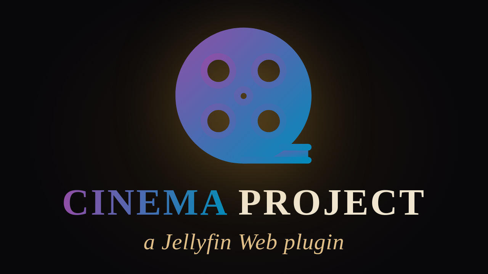

*Not affiliated with or endorsed by Jellyfin.*

---

## Contents

- [What is this?](#what-is-this)
- [Similar Projects](#similar-projects)
- [Requirements](#requirements)
- [Installation](#installation)
- [The Room](#the-room)
- [Features](#features)
- [Ambient Mode](#ambient-mode)
- [Keyboard console](#keyboard-console)
- [Smart Launch](#smart-launch)
- [Configuration & Options](#configuration--options)
- [Closing Words](#closing-words)
- [License](#license)

---

# Jellyfin Cinema Project

A first-person 3D room built from your Jellyfin library, not really made for watching movies in (though you can), but for stepping into the mood for one.

---

## What is this?

Every movie already has a soul: most of it buried in a poster and a thumbnail. Cinema Project builds a real room around that instead: poster art lining the walls, a fanart and video slideshow across the backwall, theme songs filling the room, and trailers, theme videos, or the movie itself playing on the screen up front.

The point isn't to watch the film in here. Jellyfin already does that perfectly well on its own. The point is what happens before you press play: walking through your own library, letting the posters, the music, and the lighting put you in the mood for what you're about to watch. Cinema Project is built for that feeling, not as a replacement for your player.

On top of the room itself, Ambient Mode lets you put together your own little show that plays on its own, like a pre-roll, or the feeling of walking into a cinema lobby before the movie starts.

---

## Similar Projects

A few other projects have popped up recently that also bring Jellyfin into 3D. For completeness, here's what they do and how Cinema Project differs.

**[Halcyon Video](https://github.com/halcyon-video/halcyon-video)** rebuilds your library as a walkable 1990s video rental store: shelves, genre aisles, a checkout counter, VHS/DVD aesthetics, even a clerk NPC. The goal there is nostalgia and an authentic "store" feeling, so you browse more like you're pulling a case off a shelf than freely moving around like in a shooter. It also runs as its own standalone service alongside Jellyfin (its own Docker container, its own login screen), not as a script running inside Jellyfin Web itself. Cinema Project deliberately goes a different way: no extra service, no separate login, free movement, and the focus on mood and atmosphere rather than recreating a real store.

**[PixelReel](https://github.com/Samarth-programming/PixelReel)** is a Minecraft mod that brings Jellyfin (and a few other media servers) into Minecraft as an in-world screen, letting you place a TV or a cinema screen somewhere in your own Minecraft world. That requires a running Minecraft install and license, and the library itself stays a normal flat screen inside that world, not a room you walk through. Cinema Project doesn't need a second game or platform at all; it runs directly inside the Jellyfin Web client.

There was also a **[Reddit showcase of a 3D "cinema foyer"](https://www.reddit.com/r/jellyfin/comments/1uu75kn/comment/oxgbl41/)**: an existing three.js base was hooked up to Jellyfin and Jellyseerr with a handful of AI prompts. The author themselves describes it as a fun rushed project, running privately on their own NAS, and it was never released as an installable project for others. Cinema Project, in contrast, is built from the ground up to be installed, configured, and actually used by other people, and the approach behind it was clear from the start: no extra server, no separate service, nothing else to set up alongside Jellyfin. Just one install, one click, and it's running, friendly enough for someone who isn't a software engineer.

---

## Requirements

Cinema Project needs a real desktop browser: WebGL2, three.js, mouse-driven look controls, a keyboard console. None of that works on a phone, tablet, or TV, so the Cinema button simply won't appear there.

Specifically, this means the Jellyfin Web client in a desktop browser. It does **not** work in the official Jellyfin apps for Android, webOS, other TV platforms, or desktop, since none of those run the Jellyfin Web page this script attaches itself to.

- Jellyfin Web 10.10.7 (other versions untested)
- Desktop browser, Chromium-based (tested: Google Chrome; WebGL2 support included by default)
- Windows 11 (tested environment)
- Full controller support is built in and tested; an Xbox Elite Series 2 controller was used for testing
- If you go with the standalone script (no plugin, no persistence, see [Installation](#installation)), you'll also need a JavaScript injector, such as the [Jellyfin JavaScript Injector](https://github.com/n00bcodr/Jellyfin-JavaScript-Injector) plugin or a userscript manager like Tampermonkey/Violentmonkey. Not needed with the plugin variant, which injects the script itself.

Other operating systems, browsers, or Jellyfin versions may work but haven't been tested.

A quick word on that Jellyfin version: yes, 10.10.7 is no longer the newest release. It's simply what I still run myself, it's still widely used, and the newer versions broke completely on my own setup. I'm sorry for not building this against the latest Jellyfin, but that's where things stand. Forks that bring this up to date for a newer version are very welcome.

### Artwork & metadata

Cinema Project only really comes alive if your library already has the artwork and metadata to fill it with: theme songs, theme videos, trailers, and the full range of artwork types, from `poster.jpg` and `backdrop.jpg` (plus extra `backdrop1-X.jpg` files) to `landscape.jpg`, `clearlogo.png`, and `discart.png`. Every movie artwork type listed on [fanart.tv](https://fanart.tv) is used, with the exception of `clearart.jpg` and `banner.jpg`.

A tip for `backdrop1-X.jpg`: avoid using the same or near-identical images multiple times, and avoid backdrops with text baked into them. Both make the backwall slideshow look repetitive or cluttered.

- **Video files**: only `.mp4` and `.mkv` have been tested. `.avi` explicitly does **not** work.
- **Theme songs**: only `.mp3` has been tested.
- **Trailers**: both conventions are supported, a `-trailer.ext` file next to the movie, and a `trailers` subfolder. Cinema Project picks up everything it finds either way.
- **Theme music**: both conventions are supported, a `theme.mp3` file directly, and a `theme-music` subfolder. Again, everything it finds gets picked up.
- **Theme videos**: only the `backdrops` subfolder convention is supported.
- **Subtitles**: not supported. Movies play back without any subtitle track, selectable or otherwise.

---

## Installation

There are two ways to install Cinema Project, and both end up running the exact same script with the exact same feature set. You only need one of them.

One more thing worth knowing either way: Cinema opens in its own new browser tab, built as a Blob URL. **That's genuinely tied to the tab that created it, you have to keep the original Jellyfin Web tab open in the background.** Closing it will end the Cinema tab along with it, since the browser ties a Blob URL's lifetime to the document that generated it in the first place.

### Option A - Plugin (recommended)

1. In Jellyfin, go to **Dashboard → Plugins → Repositories → Add Repository** and add:
   ```
   https://raw.githubusercontent.com/chrissix666/Jellyfin-Cinema-Project/main/manifest.json
   ```
2. Go to **Catalog**, find **Cinema Project** (category: Experimental), install it, and restart the Jellyfin server.
3. Reload Jellyfin Web. A Cinema button appears in the header on supported desktop browsers.

**Where the Cinema button shows up in the Jellyfin Web header**

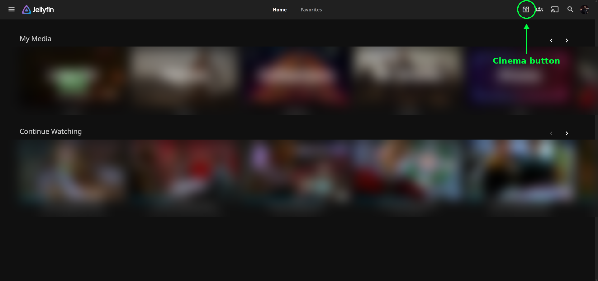

4. Don't miss the plugin's own settings page under **Dashboard → My Plugins → Cinema Project**. This is easy to overlook, but it's worth finding: settings changed here are saved permanently and apply server-wide for everyone, unlike the in-room Options menu (`M` key), which only affects your current browser session and resets the moment you close the tab. See [Configuration & Options](#configuration--options) for the full picture.

The plugin hooks itself into the Jellyfin Web interface automatically, so no separate injector step is needed. The script itself is delivered via jsDelivr.

### Option B - Standalone script (no plugin)

1. Install a JavaScript injector, for example the [Jellyfin JavaScript Injector](https://github.com/n00bcodr/Jellyfin-JavaScript-Injector) plugin, or a userscript manager such as Tampermonkey/Violentmonkey.
2. Add the contents of [`Jellyfin-Cinema-Project.js`](Jellyfin-Cinema-Project.js) as a new script entry.
3. Save and reload Jellyfin Web. The Cinema button appears in the header.

Keep in mind: with this variant, the in-room Options menu still lets you change anything you like, but **none of it is saved beyond your current session, it resets the moment you close the tab**. If you want changes to actually stick, the only way here is editing the defaults directly inside the `.js` file itself. See [Configuration & Options](#configuration--options) for the full picture.

---

## The Room

The Cinema room is made up of a few different elements, each with its own job.

**The Kiosk** is the room's input element. Walk up to it and it rises out of the floor. This is where you search, filter, and sort, by movies, favorites, collections, genres, tags, studios, or people. The physical kiosk itself is really just theater, though, not a requirement: the search panel opens from its own keyboard/controller shortcut regardless of whether you've walked up to anything, so how the kiosk actually appears in the room is entirely optional. By default it dynamically rises when you approach and retracts when you step away, but it can also be set to stay permanently risen, or turned off entirely so no physical object exists in the room at all, without the shortcut losing any of its function either way. It also carries its own bit of showmanship: it can display a 3D clearlogo of whichever movie's poster effect is currently active, with adjustable floating speed and an optional glitch effect (frequency and intensity both tunable). When a movie has no clearlogo of its own, it falls back to Cinema Project's own wordmark logo instead, or that wordmark can be shown permanently regardless, depending on how it's set.

**Kiosk with rotating logo and rotating discart projection**

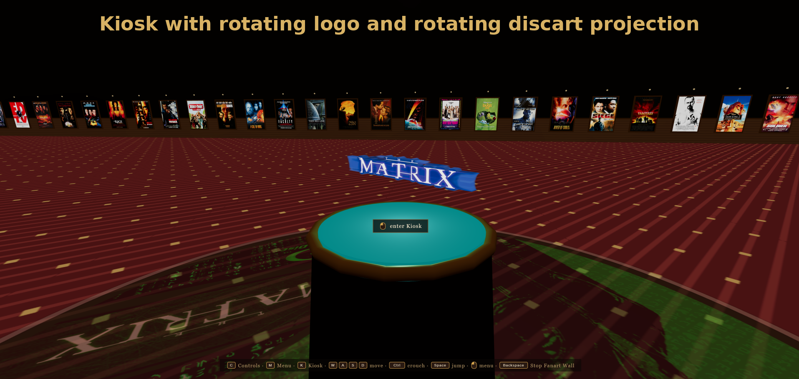

**The Kiosk's own search, filter, and sort panel**

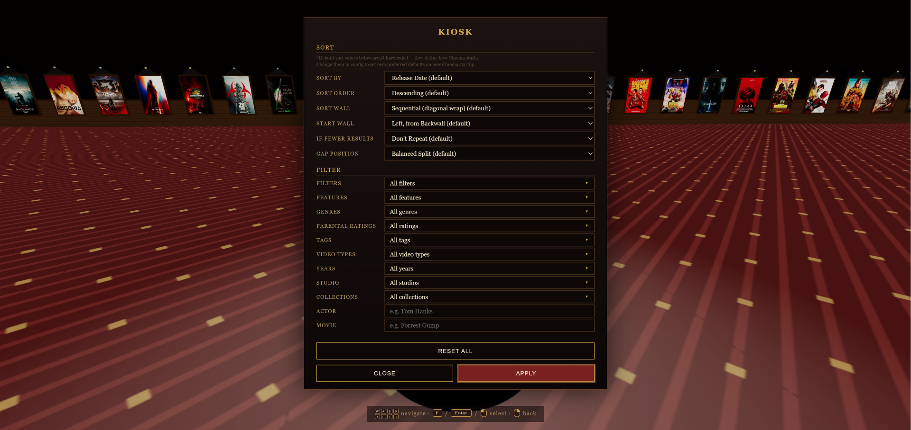

**The Front Wall**, the screen up front, is output too, and doubles as two different things depending on what's active: a video wall for the video poster effects (Movie, Trailer, Theme Video), showing exactly that, or an art wall for the non-video ones (Theme Song, Fanart Wall), optionally showing a still image instead when Screen Art is enabled for it: the movie's own landscape artwork where available, or its fanart with the clearlogo layered on top if not, or its poster as a last resort. See [Screen Art](#environment-effects) below for the full picture.

**The Side Walls (the posters)** are both input and output, and where the actual interaction with Cinema Project happens. The Kiosk only sorts, filters, and searches; it's the posters themselves that trigger anything. They show the artwork itself, but you can also interact with them directly: walk up, interact, and a menu opens with a set of poster effects to choose from. See [poster effects](#poster-effects) below. The whole library can also be paged through as a wall at a time, rather than one poster at a row.

**The Back Wall**, behind you as you browse, is a pure output element: a fanart wall. The main artwork sits centered, with the movie's clearlogo above it, and an optional grid to either side (off, 1x1, or 2x2) fills in with your own extra fanart images, optionally mixed with video, trailers, theme videos, or short movie clips (see [Features](#features) for the full breakdown of how that mix works).

**The four Backwall grid states: off, 1x1, 2x2 images, 2x2 images and videos mixed**

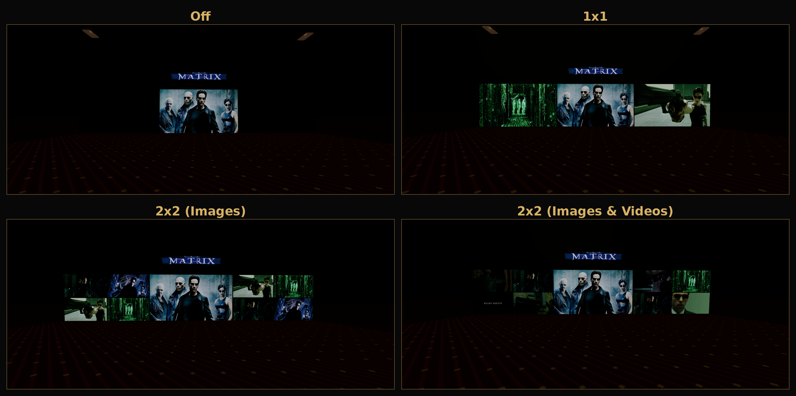

### Poster effects

Interacting with a poster opens a menu offering:

- **Go to Library**: jumps back to that movie's own page in Jellyfin Web, either in a new tab that opens the item directly, or by just navigating the original tab there without switching to it, whichever you've set under [Configuration & Options](#configuration--options)
- **Movie**: plays the movie itself on the screen up front, seekable via chapter, percent, resume, and replay commands from the [keyboard console](#keyboard-console)
- **Trailer**: plays the movie's trailer on the screen
- **Theme Video**: plays the movie's theme video on the screen
- **Theme Song**: plays the movie's theme song, filling the room with sound
- **Fanart Wall**: that movie's own environment effects, running entirely on their own with no audio or video actually playing, essentially already included inside every other poster effect above and pulled out here as its own standalone option
- **Ambient Mode**: hands the room over to the automatically running show described below

Which of these appear in the menu at all is itself configurable (see [Configuration & Options](#configuration--options)), and an entry that's enabled but unavailable for a given movie (a trailer that doesn't exist, say) can either show up greyed out or be hidden from the menu entirely.

**A poster before and after interacting with it, opening its effect menu**

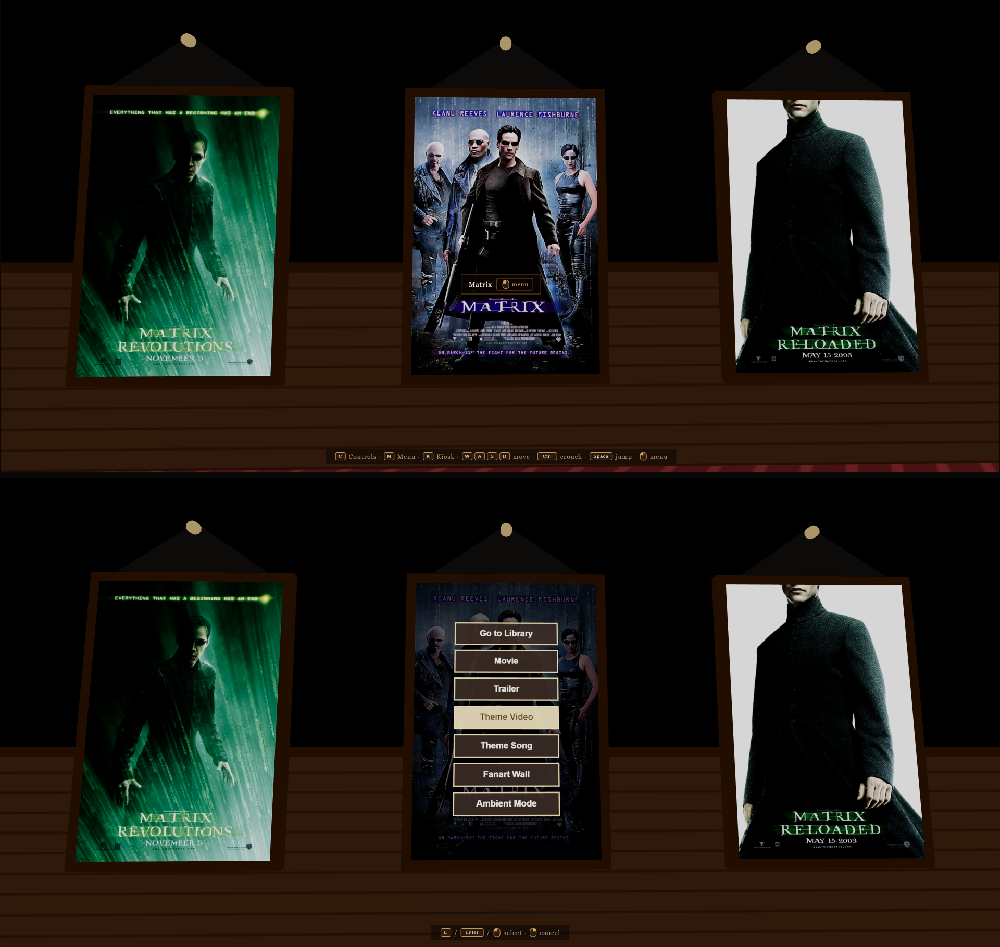

### Environment effects

Movie, Trailer, Theme Video, Theme Song, and Fanart Wall each also trigger their own combination of environment effects: what the rest of the room does while that poster effect plays. The available environment effects are:

- **Backwall Art**: the fanart/video slideshow across the backwall
- **Screen Art**: the Front Wall, doubling as a video wall for video poster effects (Movie, Trailer, Theme Video) and as an art wall for the non-video ones (Fanart Wall, Theme Song), showing that movie's landscape artwork, or its fanart with the clearlogo layered on top as a fallback, when there's no video to actually show
- **Disc Art**: a rotating disc on the floor around the kiosk, in the exact same spot where the kiosk's own spotlight normally projects down when the room is lit
- **Poster Light**: whichever poster currently has a poster effect playing always keeps its own light lit, working as a visual indicator regardless of anything else. What this toggle actually controls is every other poster's light in contrast: on, everyone stays lit normally; off, every other poster goes dark, turning the active one into a genuine spotlight
- **Dim Room**: dims the rest of the room's lighting

Each of the five poster effects above has its own configurable set of environment effects. Playing a Theme Song, for example, doesn't need Screen Art active the same way playing the Movie itself does, so each combination can be tuned independently. Fanart Wall is really just this layer by itself: it's what any of the other four poster effects look like with the audio or video stripped out, the environment effects running standalone instead of alongside something else.

Movie, Trailer, Theme Video, and Theme Song also each have their own volume and loop setting. Trailer, Theme Video, and Theme Song additionally each have their own Playback Order for movies that have more than one to choose from: always the first one found, cycling through all of them in order, one random pick, or all of them shuffled. Theme Song goes further still, with its own full timing suite: where in the song playback starts (the beginning, or a random point within a configurable range), a delayed start, an early end, and a fade in/out, each measured in seconds. When Playback Order is set to cycle through more than one song, the delayed start and the fade in/out pair can each be set to apply only to the very first song of a session or to every song the queue advances to.

With looping off, Movie, Trailer, and Theme Video can each be told what to do once they finish, rather than just falling silent: automatically continue into the Theme Song, show the Front Screen Art, both, or neither. Trailer and Theme Video can also each have their own audio replaced with the movie's theme song instead of their original sound, with its own playback order and start position settings, separate from the Theme Song poster effect's own; and if a movie has no theme song of its own to swap in, there's a choice of keeping the original audio instead or muting it entirely.

**Ambient Mode** ties both of these together: every step in an Ambient Mode sequence is one poster effect (Movie, Trailer, Theme Video, Theme Song, or Fanart Wall) paired with its own custom combination of environment effects, rather than reusing that poster effect's usual default. This is what lets a sequence, for example, play a theme song with the backwall dimmed on one step and lit up with Poster Light on the next.

**The sound in the room** is likewise pure output, driven by whichever poster effect (or Ambient Mode step) is currently active.

**Room size** can be changed seamlessly at any time, growing or shrinking with a smooth animation, no reload and no leaving the room required. There are three sizes to pick from, 10, 20, or 30 posters per wall, and two ways of scaling into a bigger size: Length Only, which just extends the room, or Full Scale, which scales the whole room proportionally. In Full Scale mode specifically, movement speed and the player's own position can each independently be told to scale along with the room, or stay exactly as they were before the resize. Which size the room starts at by default is itself configurable.

**10 posters per wall: idle, bright, and dark states**

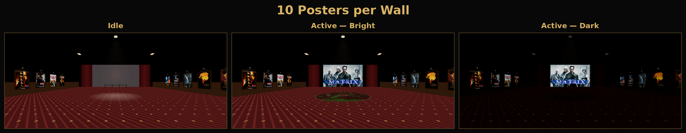

**20 posters per wall: idle, bright, and dark states**

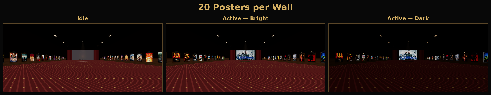

**30 posters per wall: idle, bright, and dark states**

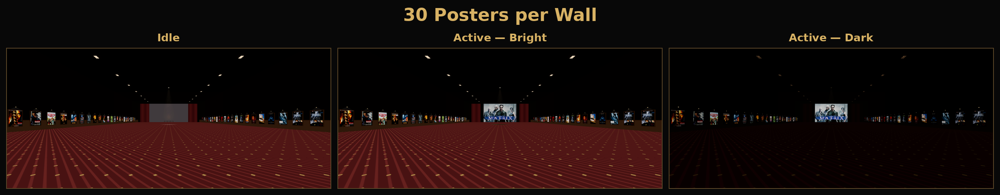

The room can also be redressed entirely: six different themes (Velvet, Starship, Neon, Cyber, Classic, Lounge) reskin the walls, floor, curtain, kiosk, and lighting mood, without changing the room's actual shape.

### Controls

**The in-room controls list, opened with the C key or the View button on a controller**

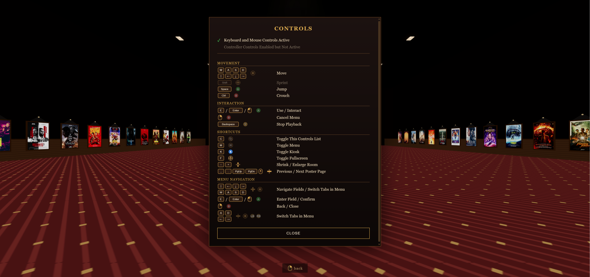

| Action | Keyboard/Mouse | Controller |
|---|---|---|
| Move | WASD / Arrow keys | Left stick |
| Sprint | Shift | Left stick click |
| Jump | Space | A |
| Crouch | Ctrl | B |
| Use / Interact | E / Enter / Left click | A |
| Cancel / Back | Right click | B |
| Stop playback | Backspace | Y |
| Toggle controls list | C | View |
| Toggle Options menu | M | Menu |
| Toggle Kiosk | K | X |
| Toggle fullscreen | F | Right stick click |
| Shrink / enlarge room | - / + | D-Pad up/down |
| Previous / next poster page | , / . / PgUp / PgDn / mouse wheel | D-Pad left/right |

Every action in the room, movement, interaction, menu navigation, resizing the room, browsing the poster wall, works identically with a controller as it does with a keyboard and mouse. Look sensitivity and controller deadzone are both adjustable in the Options menu, and two smaller behaviors are configurable too: Auto Sprint, on by default, means you're already moving at sprint speed without holding Shift at all; and Crouch Mode can be set to either hold Ctrl down or toggle it with a single press.

Once the Options menu itself is open, the scheme switches to something more familiar: Arrow keys or WASD (D-Pad or left stick on a controller) move between fields and switch tabs, E/Enter/left click (A on a controller) confirms, and right click (B on a controller) closes it. Tabs can also be switched directly with A/D, the left/right arrow keys, or a controller's bumpers.

---

## Features

- **An enormous amount of configurability**: from the overall look down to individual details (down to things like the rope barrier at the kiosk, the browser tab icon, or whether "Go to Library" opens in a new tab), almost everything can be adjusted. In-room, that's instant and needs no detour through any menu outside the room itself; saving it permanently is a separate story (see [Configuration & Options](#configuration--options))
- **Seamless room resizing**: three sizes (10/20/30 posters per wall), two scaling modes (Length Only or Full Scale), a configurable default, all switchable at any time with no reload
- **Six room themes**: Velvet, Starship, Neon, Cyber, Classic, and Lounge redress the entire room's look on the fly
- **The whole library, browsable page by page**: the entire poster wall can be paged through
- **A Kiosk for searching, filtering, and sorting**: sorting is really two separate categories stacked on top of each other. Jellyfin sort picks which movies come first and in what order, straight from Jellyfin itself (Sort By, with every option it offers, and Sort Order, Ascending or Descending). Wall layout is Cinema Project's own layer on top of that, controlling how that already-sorted list actually gets laid out across the physical wall: Sort Wall decides the pattern it fills in, Start Wall decides which corner it starts from, Repeat Mode decides whether a short result list repeats to fill empty slots or just shows once, and Gap Position decides where any leftover space ends up. Filtering covers every Jellyfin filter as well (multi-select, same as Genres, Studios, Tags, Collections, and the rest), plus a dedicated autocomplete search for locking straight onto one specific Movie or Person
- **Fine-grained lighting and audio control**: the room's overall lighting has its own separate brightness for when a poster effect is active versus idle, and the screen, backwall, and poster wall each additionally have that same active/idle split as their own independent brightness pair, plus a further, separate brightness just for the poster light. On the audio side, there's the option to replace a trailer's or theme video's own audio with the movie's theme song instead, complete with its own fallback rule for movies that don't have one
- **Full controller support**: a genuine first-class input method, not an afterthought. Movement, interaction, menu navigation, room resizing, and poster-wall browsing all work exactly the same with a controller as with keyboard and mouse
- **Backup & restore** *(plugin only)*: export your entire server-side configuration as a code string and import it again later, or on another server

Ambient Mode, the in-room keyboard console, and Smart Launch are each substantial enough to get their own chapter below.

---

## Ambient Mode

Ambient Mode is the automatically running show that takes over the room when nobody's actively browsing, functionally identical to a poster effect itself (it's one of the seven [poster effects](#poster-effects), and can also be triggered directly by walking up to a poster and picking it, or from the console).

There are three independent profiles to build. Each one holds up to ten sequence steps, has its own toggle for whether it loops back to the start once finished, and its own step count. Building all of this in the plugin's own admin settings saves it permanently rather than just for the current session, and the editor there also gives a compact, collapsed overview of every sequence at a glance (poster effect, duration, and environment effects, all in one line) before you expand any one of them to fine-tune it further.

**The persistent Ambient Mode editor in the plugin admin settings, with an overview of every sequence**

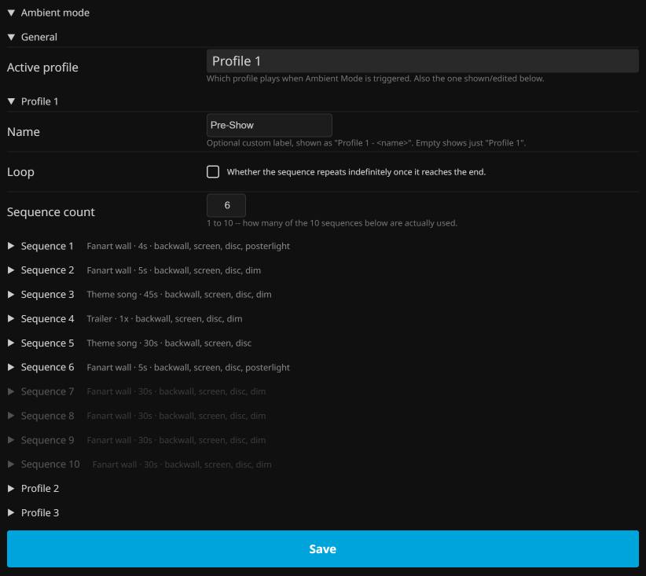

Every sequence step is built from the same two layers the rest of the room uses:

- **A poster effect**: Movie, Trailer, Theme Video, Theme Song, or Fanart Wall, picking what that step actually plays (and, for Movie/Trailer/Theme Video/Theme Song, from the whole library, in either library order or randomized)
- **A custom set of environment effects**: its own combination of Backwall Art, Screen Art, Disc Art, Poster Light, and Dim Room, independent of whatever that poster effect's own global default is (see [Environment effects](#environment-effects))

On top of that, each step has its own detailed timing and playback controls:

- **Duration**: how long the step runs before moving on, and whether it loops within itself while it does
- **Volume**: the step's own audio level
- **Movie/trailer start position**: whether playback starts from the beginning or a random point (with a configurable min/max range for how random)
- **Theme song timing**: independent controls for a delayed start, an early end, and a fade in/out, each of which can optionally apply only the first time the step plays rather than every time, plus its own start-position and randomized-range settings, same as movie/trailer above
- **Audio replacement**: the same trailer/theme-video audio-replace option available elsewhere, settable per step
- **Fallback behavior**: what happens if this step's own choice of content isn't actually available for whatever gets picked

This much control means a profile can, for example, open on a slow fanart wall with the room dimmed, ease into theme songs with a fade in and a delayed start, and only bring the screen and full lighting in for a specific step, all without touching any other step's own settings.

---

## Keyboard console

Interaction has a typed layer too: press Enter whenever no menu is open and nothing is focused, and a small command line appears. It's built for lazy, fuzzy typing rather than exact matching, and it accepts commands in more or less any order.

### Typing a title

Typing a movie title on its own plays that movie. A title can also be combined in the same command with a chapter or a percent mark to start at: `gladiator 65%`, `gladiator chapter 5`, `gladiator chapter <any chapter name>` (matched case-insensitively against that movie's own actual chapter names in Jellyfin, not a fixed keyword, just whatever text is really in there), or a random one of either, `gladiator random%`, `gladiator chapter random`, jumping straight to that point the moment it starts playing, rather than needing a second command once it's already on screen. See [Play commands](#play-commands) below for how `play`, `start`, `resume`, and `replay` fit into all this, and [Random](#random) further down for everything else `random` can do. Title matching itself ignores case and accents, and is deliberately lazy about how it narrows things down:

1. First, it tries an exact match, treating `:` and ` - ` (or an em dash) as a soft break and stripping out anything in parentheses.
2. If that doesn't land on exactly one movie, it tries again without a trailing bracketed group.
3. If that still doesn't land on exactly one movie, it tries once more without everything after the first `:`/` - ` break, i.e. the movie's subtitle.

It stops as soon as any of these three stages narrows things down to a single, unambiguous match, and gives up rather than guessing if a stage still returns more than one.

### Play commands

`play`, `start`, `resume`, and `replay` each mean something slightly different, and every one of them works two ways: right after a title (`gladiator resume`), or bare with no title at all, acting on whatever movie is already playing:

- **`play`/`start`**: entirely optional. A bare title on its own already means "play it from the beginning", so these two are purely there if you'd rather type them explicitly
- **`resume`**: continues from Jellyfin's own saved playback position for that movie, if it has one, whether typed after a title or bare on whatever's currently playing
- **`replay`**: explicitly restarts from the true beginning, overriding any resume, chapter, or percent position it might already be sitting at

### Effect words

Adding an effect word after the title picks what plays instead of the movie itself. Typed alone, without any title, the same words act on whatever's currently playing.

| Effect | Aliases |
|---|---|
| Movie | `movie` |
| Trailer | `trailer` |
| Theme Video | `themevideo`, `theme video`, `video theme`, `backdrop`, `video` |
| Theme Song | `themesong`, `theme song`, `song theme`, `song`, `ost`, `soundtrack`, `main theme`, `theme` |
| Fanart Wall | `fanartwall`, `fanart`, `fanart wall`, `wall fanart` |
| Ambient Mode | `ambient`, `ambiente`, `ambiente mode`, `ambient mode` |
| Go to Library | `library` |

### Bare commands

A couple of positional commands need no title at all, and act on a movie that's already playing (this doesn't apply to trailer/theme video/theme song). Both also combine with a title instead, see [Typing a title](#typing-a-title) above:

- `chapter 5`, or `chapter <any chapter name>` (whatever that movie's own chapters are actually called in Jellyfin, matched case-insensitively, not a fixed keyword)
- `65%`, `65 percent`

### System & navigation commands

These work standalone too, and aren't tied to anything currently playing:

- **Poster page, single jumps**: `next page`/`page next`/`forward page`/`page forward`/`next`/`forward` (one page forward) · `previous page`/`prev page`/`page previous`/`page prev`/`back page`/`page back`/`previous`/`prev` (one page back)
- **Poster page, multiple jumps**: any count works in either word order, with or without "page(s)": `3 next`, `next 3`, `3 page next`, `next 3 pages`, all jump three pages forward in one go
- **Poster page, start/end jumps**: `page last`/`last page`/`last`/`end` (jump straight to the last page) · `page first`/`first page`/`first`/`begin` (jump straight to the first page)
- **Room size**: `enlarge`/`increase` (grow one step) · `reduce`/`decrease`/`shrink` (shrink one step)
- **Panels & UI**: `kiosk` (opens the Kiosk panel) · `options` (toggles the Options menu) · `controls` (toggles the controls overlay) · `stop` (stops Ambient Mode and any playback)
- **Fullscreen**: `fullscreen` (enter) · `window`/`windowed` (exit)
- **Lighting**: `on`/`light`/`light on`/`lights on`/`bright`/`brighten`/`illuminate` (lights up) · `off`/`dark`/`darken`/`light off`/`dim` (lights down)
- **Audio**: `mute`/`sound off` · `unmute`/`sound on`
- **Home**: resets the Kiosk panel and every wall setting (Sort By, Sort Order, Sort Wall, Start Wall, Repeat Mode, Gap Position) back to their defaults in one go

### Reset

`reset` is its own, more targeted counterpart to `home`, undoing filters specifically rather than wall settings:

- **Bare `reset`**: clears every active filter at once (genre, year, tag, rating, feature, general filter, video type, studio, person), leaving sort and wall layout exactly as they were
- **`reset <category>`** (for example `reset genre`): clears just that one category, leaving every other active filter untouched
- **`reset <category> <value>`** (for example `reset genre action`): removes only that specific value from the category, rather than clearing the whole thing
- Several categories or values can be combined in one command, and the words `filter`/`filters` right after `reset` are accepted but optional, they don't change anything

### Filters and sorts

Filters (genre, year, tag, rating, feature, general filter, video type, studio, person, collection) and sorts (Sort By, Sort Order, Sort Wall, Start Wall, Repeat Mode, Gap Position) can both be typed straight into the console. Neither one needs an umbrella word in front to work: you just type the category directly (`genre action`, not `filter genre action`), and the same goes for sorting, `sort` and `wall` can optionally be typed right before a sort or wall value if you'd rather read it that way, but they're pure filler and change nothing either way, `sort name` and plain `name` do the exact same thing.

The category words themselves are forgiving too: `studio` and `network` mean the same thing, as do `person`, `actor`, `actress`, and `celeb`, and `collection` is recognized in close to twenty languages, not just English.

| Sort By | Aliases |
|---|---|
| SortName | `name` |
| CommunityRating | `community rating` |
| CriticRating | `critics rating`, `critic rating` |
| DateCreated | `date added` |
| DatePlayed | `date played` |
| OfficialRating | `parental rating` |
| PlayCount | `play count` |
| PremiereDate | `release date` |
| Runtime | `runtime` |
| Random | `random` (bare) or `sort random` (see [Random](#random) below) |

| Wall setting | Values / aliases |
|---|---|
| Sort Wall | `alternating`/`alternate`, `sequential`/`sequence`, `wrap`/`wraparound`/`sequential wrap` |
| Start Wall | `left screen`, `left backwall`/`left back`, `right screen`, `right backwall`/`right back` |
| Repeat Mode | `repeat`/`loop`, `no repeat`/`norepeat`/`once` |
| Gap Position | `end`/`gap end`, `center`/`centered`/`middle`, `second center`/`center second`, `balanced`/`spread`/`even` |

Filters and sorts also behave differently across separate commands. Filters are not additive: typing a filter command replaces whatever filters were active before, rather than adding to them. Sorts are additive: a command that only sets a Sort By, for instance, leaves whatever's currently active for Sort Order, Sort Wall, and the rest untouched. `random` bends both of these rules in its own particular way, see [Random](#random) below for the full picture.

### Combining commands

Sort and filter categories can be freely mixed and stacked within a single command, in more or less any order:

- `genre action year 1990` sets a genre and a year filter together
- `sort runtime descending` sets both Sort By and Sort Order in one go
- `genre horror studio a24 sort name ascending` combines two filter categories with two sort fields, all at once
- `tag christmas alternating right screen` sets a filter alongside two of the wall settings (Sort Wall and Start Wall)

There's no real limit to how many of these get stacked together in one line, as long as each value ends up next to the category it belongs to.

### Random

`random` isn't one single thing, it means something different depending on what else is in the command:

- **Bare `random`**: reshuffles the wall to a random order, from the whole library. Combined with filters in the same command (`random genre action`), it reshuffles randomly within just that filtered set instead, following the same non-additive rule filters always follow
- **`sort random`**: the one way to make Random behave as a normal, additive sort field instead, one that stays active and combines with everything else the way `name` or `runtime` would, rather than being a one-off reset. The word `sort` immediately before it is what changes its meaning
- **`random` plus an effect word, or `random play`/`play random`**: picks a random movie (optionally filtered, same rule as above) and immediately starts that effect for it, or the movie itself for `play`/`start`, rather than just reshuffling the wall and leaving it at that
- **`random effect`/`random poster effect`/`random play effect`/`play random effect`**: bare only, doesn't combine with a title. Context-dependent: with something already playing, it swaps in a random poster effect for that same item. With nothing playing, it picks an entirely new random movie first and gives it a random poster effect
- **`random%`/`random %`/`random percent`, `chapter random`/`random chapter`**: works both ways. Bare, with a movie already playing, it seeks to a random position or chapter within it. Combined with a title (`gladiator random%`, `gladiator chapter random`), it starts that movie fresh at a random position or chapter right away

---

## Smart Launch

Press the Cinema button from a specific view already open in Jellyfin Web, rather than from the general dashboard, and Smart Launch carries that context straight into the room instead of always starting fresh.

- **Sort**: carries over the active sort from the Jellyfin Web view, where available
- **Filter**: carries over active filters the same way
- **Scroll position**: whichever card is fully visible, topmost-leftmost, in Jellyfin Web becomes the Poster Wall's own starting point (every supported view except Collections, which has no scrollable card grid of its own, and Movies detail view, which uses its own auto-play behavior below instead)

Each of the views Smart Launch supports can be toggled independently: Movies (general view), Movies Favourites, Collections, Genres, Tags, Studios, and Persons. Person pages get one extra nuance: filters and sort still carry over as usual, but Cinema always sorts that person's own movie list with its own default sort rather than whatever was active in Jellyfin Web.

### Auto-play from detail view

Movies (detail view), a specific movie's own page in Jellyfin Web, is where Smart Launch gets genuinely satisfying. A details page can't reliably tell which of several possible prior list views (each with a potentially different sort or filter) it was actually reached from, so rather than guessing, it always starts the Poster Wall on that exact movie with Cinema's own default sort. Its toggle then doubles as the main switch for auto-play: with it on, opening Cinema from a movie's page doesn't just start you standing in front of its poster, it jumps straight into any poster effect for that movie right away, Movie, Trailer, Theme Video, Theme Song, Fanart Wall, or Ambient Mode. One click on a movie in Jellyfin Web, and you're already watching its trailer inside the room.

---

## Configuration & Options

Everything the room lets you adjust lives in the **Options menu** (`M` key), split across six tabs. Changes take effect immediately.

- **Controls**: movement speed, auto sprint, jump, crouch mode, controller settings (including deadzone and look sensitivity), and how the keyboard console's own indicator looks and behaves
- **Display**: crosshair, on-screen controls UI, field of view, player height, and every brightness level in the room (overall lighting, screen, backwall, poster wall, each with their own active/idle split, plus the poster light on top)
- **Room**: room theme, room size and scale mode, kiosk appearance and its branding logo behavior, and the rope barrier
- **Posters**: which poster effects show up in the interaction menu at all, environment effects per poster type, individual volume and playback order for Trailer/Theme Video/Theme Song when a movie has more than one, Theme Song's own full timing suite (start position, delay, fade in/out), trailer/theme video audio replacement, and the entire Ambient Mode editor (all three profiles and every sequence step)
- **Backwall**: the main fanart and clearlogo up top can either stay static or shuffle on a timer, with off/auto/forced overscan handling. Beyond that, there's an optional side grid for your extra `backdrop1-X.jpg` images, off, 1x1, or 2x2, mirrored on both sides of the backwall, with an option to balance video tiles evenly across both sides rather than letting them cluster on one. Trailers and theme videos can optionally be shuffled into that same grid, each with its own order mode (always the first one found, cycling through all of them, one random pick, or a shuffled rotation) and its own start position (from the beginning, or a random point). Movies play a random scene instead, clipped to a configurable percentage range (say, only ever showing something between 10% and 90% into the runtime, never the very start or end). Each of the three video types, trailers, theme videos, and movies, has its own slot count, so you can dial in how much of the grid leans toward one or the other, or turn any of them off entirely
- **Misc**: the browser tab icon, where "Go to Library" opens, and a read-only view of the active Smart Launch settings (Smart Launch itself is only actually editable in the plugin's admin settings, see below, which is also where the backup/restore via code lives, not here)

**The in-room Options menu, opened with the M key or the Menu button on a controller**

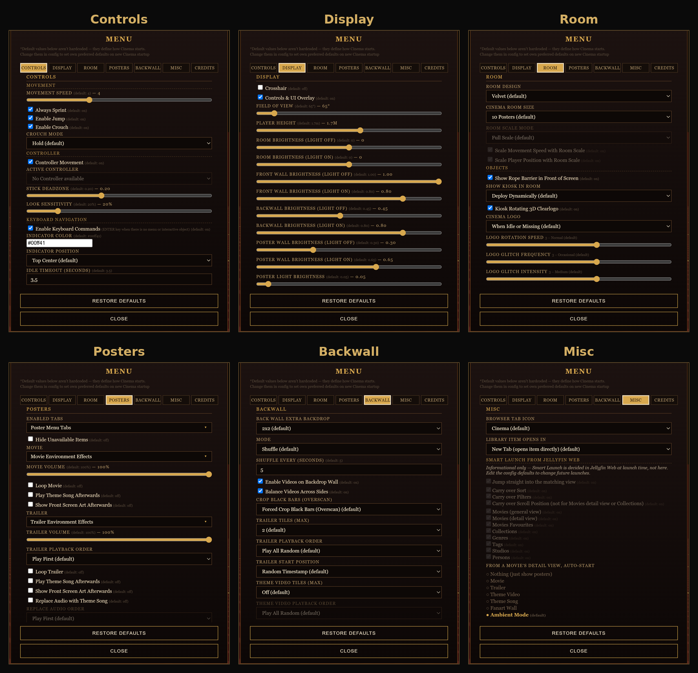

Persistence works like this:

- **In-room (Options menu)**: not persistent. Changes apply immediately but only for your current session in the current browser tab, and reset back to default the moment you close the tab or open Cinema again later
- **Plugin** (`Dashboard → My Plugins → Cinema Project`): persistent, and server-wide for everyone. Covers all seven tabs, Kiosk, Controls, Display, Room, Posters (Ambient Mode included), Backwall, and Misc, with Smart Launch living inside that last one rather than getting a tab of its own. The plugin's Misc tab also has its own backup/restore via code, generating a single code for everything saved there, which doubles as its own extra layer of persistence: a way to back up your server-wide configuration outside of Jellyfin entirely, or move it to another server
- **Standalone script** (no plugin): there's no persistence mechanism here at all, nowhere for it to save to. If you want to change what a default actually is, the only way is opening the `.js` file itself in a text editor and changing the value there directly, the same config blocks (`SMART_LAUNCH_CONFIG`, `MENU_CONFIG`) the script always reads its defaults from

**The plugin admin settings tabs, found under Dashboard → My Plugins → Cinema Project**

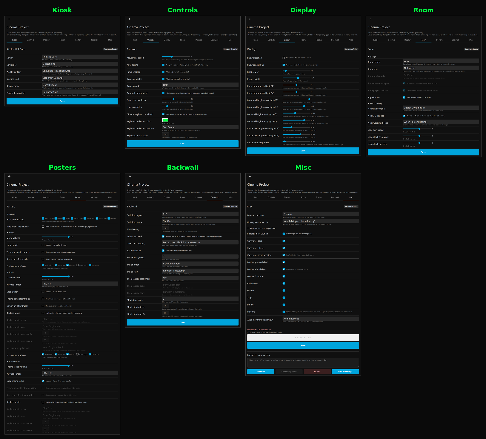

### Settings not applying?

Every once in a while, a saved setting doesn't seem to take effect right away, even after saving and reloading. To be explicit about this: **this is not a bug in Cinema Project**, it's normal browser caching behavior. Your browser can hang onto an old cached copy of the page or script instead of fetching the new one, and this same thing can happen with other Jellyfin plugins and addons too, not just this one; it's just how browsers work, not something specific to Cinema Project.

If that happens: open your browser's DevTools (right-click anywhere, **Inspect**), go to the **Network** tab, and check **Disable cache**. Leave DevTools open, don't close it, then refresh the page and open Cinema again from the button. With DevTools open and that box checked, the browser is forced to fetch everything fresh instead of reusing anything cached.

**Fixing settings that aren't applying: disable cache workaround**

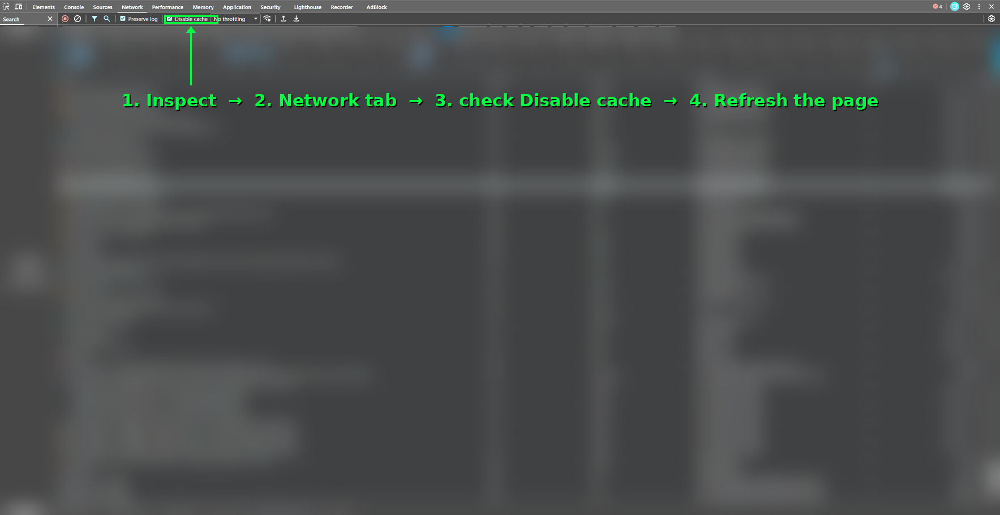

---

## Closing Words

This project was built full-time over the course of a single month, with the help of Claude Max. A Jellyfin user and fan of my other GitHub projects reached out and asked whether something like this, an experiment and showcase focused on interactivity and virtuality, would interest me, aimed mainly at children and neurodivergent people, since images, audio, and video tend to reach them more than plain thumbnails and scrolling text lists do. He sponsored a month of Claude Max for this project, around $118 worth, and asked to stay anonymous. Thank you for that, whoever you are.

I hope the result turns out to be genuinely useful and enjoyable. That said, I have to be upfront: this isn't a polished, finished product. It's an experiment and a showcase for combining media-server metadata with three.js, nothing more, nothing less. Thank you for reading this far.

---

## License

MIT License
Forking and further development strongly encouraged.

Feedback and bug reports welcome, feel free to open an issue.
